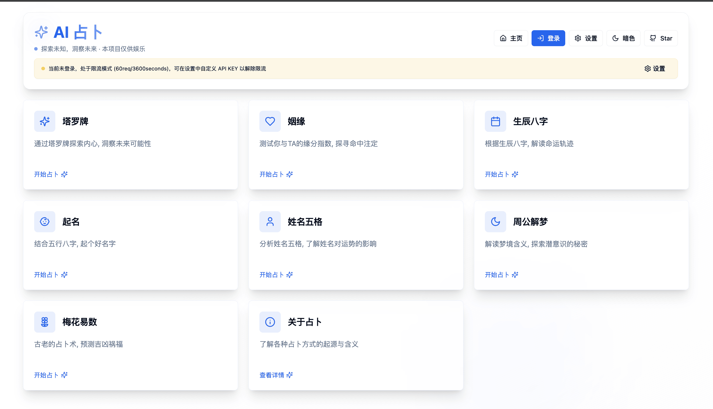

# chatgpt tarot divination

[](https://vercel.com/new/clone?repository-url=https%3A%2F%2Fgithub.com%2Fdreamhunter2333%2Fchatgpt-tarot-divination&env=api_key,api_base&project-name=ai-divination&repository-name=ai-divination&demo-title=AI%20Divination&demo-description=AI%20Divination&demo-url=https%3A%2F%2Fdivination.app.awsl.uk)

- [chatgpt tarot divination](#chatgpt-tarot-divination)
  - [AI 算命，占卜 功能](#ai-算命占卜-功能)
  - [下载 EXE 安装包](#下载-exe-安装包)
  - [Deploy by docker](#deploy-by-docker)
  - [Local Run](#local-run)

## AI 算命，占卜 功能

- [x] 塔罗牌
- [x] 生辰八字
- [x] 姓名五格
- [x] 周公解梦
- [x] 起名
- [x] 梅花易数
- [x] 姻缘 [@alongLFB](https://github.com/alongLFB)



## 下载 EXE 安装包

[下载 exe](https://github.com/dreamhunter2333/chatgpt-tarot-divination/releases/tag/latest)

设置中指定 API BASE URL, API KEY, 然后在主页就可以正常使用了

## Deploy by docker

```yaml
services:
  chatgpt-tarot-divination:
    image: ghcr.io/dreamhunter2333/chatgpt-tarot-divination:latest
    container_name: chatgpt-tarot-divination
    restart: always
    ports:
      - 8000:8000
    environment:
      - api_key=sk-xxx
      # - api_base=https://api.openai.com/v1 # optional
      # - model=gpt-3.5-turbo # optional
      # - rate_limit=10/minute # optional
      # - user_rate_limit=600/hour # optional
      - github_client_id=xxx
      - github_client_secret=xxx
      - jwt_secret=secret
      - ad_client=ca-pub-xxx
      - ad_slot=123
```

## Local Run

创建 `.env` 文件，填入如下内容, `api_key` 为必填项, 其余为可选项

```bash
api_key=sk-xxxx
api_base=https://api.openai.com/v1
github_client_id=xxx
github_client_secret=xxx
ad_client=ca-pub-xxx
ad_slot=123
```

RUN

```bash
cd frontend
pnpm install
pnpm build --emptyOutDir
cd ..
rm -r dist
cp -r frontend/dist/ dist
python3 -m venv ./venv
./venv/bin/python3 -m pip install -r requirements.txt
./venv/bin/python3 main.py
```
